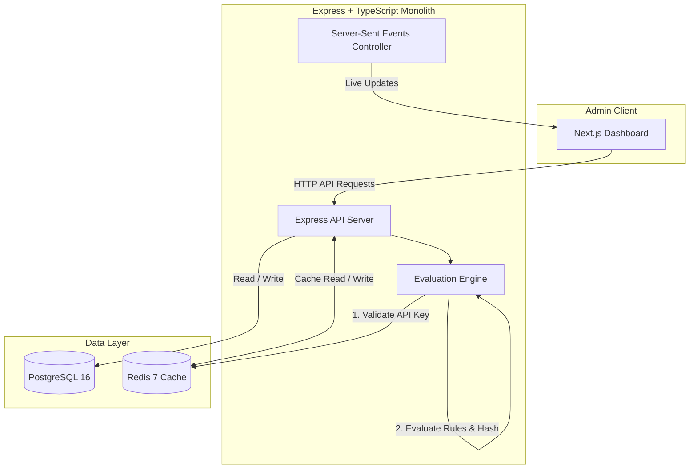
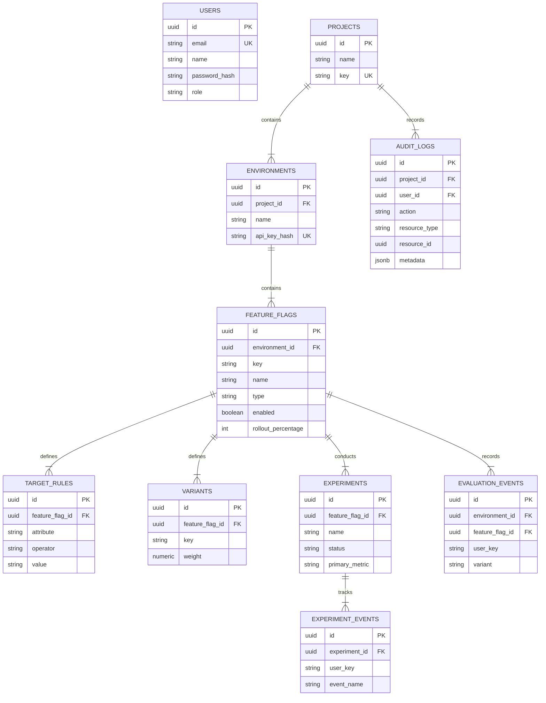

# FeatureFlow

> Feature flag and experimentation platform for controlling feature releases without application redeployment.


---

## Problem

Software engineering teams need to safely release features to target users, execute gradual percentage rollouts, run simple A/B experiments, and disable broken features instantly without rebuilding or redeploying application binaries.

---

## What It Does

FeatureFlow separates code deployment from feature exposure. The Next.js admin dashboard configures feature flags, targeting rules, rollout percentages, and experiments. Applications consume the evaluation API using an environment API key to receive deterministic decisions.

```text
Application
    ↓
Evaluation API
    ↓
Environment API Key
    ↓
Feature Flag
    ↓
Targeting Rules
    ↓
Deterministic Rollout
    ↓
Variant
    ↓
Decision
```

The admin dashboard manages configuration while client/server applications consume evaluation decisions over HTTP.

---

## Core Features

| Feature | Implementation |
| :--- | :--- |
| **Feature Flags** | Boolean toggles and multivariate flag configurations |
| **Targeting** | Rule evaluation with operators: `equals`, `not_equals`, `contains`, `in` |
| **Rollouts** | Deterministic MurmurHash3 bucket assignment (`0–99`) |
| **Variants** | Weighted variant allocation for multivariate flags |
| **Caching** | Redis caching with two-tier in-memory L1 micro-caching |
| **Fallback** | Automatic PostgreSQL query fallback when Redis is offline |
| **Experiments** | Flag-linked experiment setup, event tracking, and analytics aggregation |
| **Live Updates** | Server-Sent Events (SSE) broadcasting flag mutations |
| **Authentication** | JSON Web Tokens (JWT) with bcrypt password hashing |
| **Authorization** | Role-Based Access Control (`OWNER`, `MEMBER`, `VIEWER`) |
| **API Keys** | SHA-256 hashed environment key storage with one-time raw secret reveal |
| **Auditability** | Append-only audit logging for system actions |
| **SDK** | Light TypeScript client SDK for Node and browser evaluation |

---

## Architecture

FeatureFlow is implemented as a modular monolith in Express + TypeScript with a Next.js admin frontend.



---

## Architecture Decisions

### Modular Monolith
The backend uses a single Express TypeScript codebase organized into cohesive modules (`auth`, `projects`, `environments`, `flags`, `evaluation`, `experiments`, `audit`, `sse`). This minimizes network overhead and deployment complexity.

### PostgreSQL
Serves as the primary source of truth for projects, environments, feature flags, targeting rules, variants, experiments, events, users, and audit logs.

### Redis
Provides low-latency caching for active feature flag definitions and environment API key hashes. It also backs rate-limiting middleware.

### SSE
Server-Sent Events push real-time flag mutation notifications (`FLAG_CREATED`, `FLAG_UPDATED`, `FLAG_DELETED`) to the dashboard without WebSocket protocol overhead.

---

## Evaluation Engine

The evaluation engine evaluates incoming requests through a multi-step pipeline:

```text
Request
  ↓
Validate Environment API Key
  ↓
Load Flag Configuration
  ↓
Check Enabled State
  ↓
Evaluate Targeting Rules
  ↓
Calculate Deterministic Bucket
  ↓
Select Variant
  ↓
Return Decision
```

The engine hashes the flag key and user key using MurmurHash3 to generate a stable 32-bit integer:

$$\text{hash} = \text{MurmurHash3}(\text{flag\_key} + \text{":"} + \text{user\_key})$$

$$\text{bucket} = |\text{hash}| \bmod 100$$

This produces a consistent integer in the range `0–99`.

---

## Deterministic Rollouts

Deterministic hashing guarantees that a specific user always receives the exact same evaluation result for a given flag configuration without storing user state in a database.

### Example

```text
checkout_v2 + user_123
        ↓
MurmurHash3
        ↓
bucket = 17
```

For a **20% rollout** (`rollout_percentage = 20`):

```text
bucket 0–19  → enabled (true)
bucket 20–99 → disabled (false)
```

Because `17 < 20`, `user_123` receives `enabled: true`. Subsequent evaluations for `user_123` consistently yield `17`, preventing random flag flipping.

---

## Targeting

Targeting rules evaluate user context attributes before evaluating percentage rollout buckets.

### Supported Operators

- `equals`: Exact string or numeric equality
- `not_equals`: Inequality check
- `contains`: Substring match
- `in`: Membership match against a comma-separated list

### Example Rule

```text
Attribute: country
Operator: equals
Value: IN
```

If the evaluation context contains `country = "IN"`, the rule matches and overrides default percentage distribution.

---

## Variants

Multivariate flags allocate percentage weights across defined variants (e.g., `control` vs. `treatment`).

```text
control     → 50% (bucket 0–49)
treatment   → 50% (bucket 50–99)
```

Variant selection uses the same deterministic bucket assignment to partition users into distinct variants according to allocated weights.

---

## Evaluation Resilience

FeatureFlow incorporates graceful fallback logic to handle cache outages without failing user requests.

### Normal Flow

```text
Evaluation Request
      ↓
L1 In-Memory Cache
   ↙       ↘
 HIT       MISS
  ↓          ↓
Evaluate   Redis Cache
            ↙       ↘
          HIT       MISS
           ↓          ↓
        Evaluate   PostgreSQL
                     ↓
                   Redis & L1
                     ↓
                  Evaluate
```

### Redis Outage Behavior

```text
Redis Unavailable
       ↓
Catch Redis Error (Log Warning)
       ↓
Fall Back to PostgreSQL Query
       ↓
Evaluate & Return Response
```

If Redis disconnects or errors, `getCache` returns `null` without throwing an exception, allowing the controller to query PostgreSQL directly and serve evaluation requests cleanly.

---

## A/B Experiments

FeatureFlow supports simple A/B experiments linked directly to feature flags.

```text
User Request
    ↓
Evaluate Flag Variant
    ↓
Expose Variant to User
    ↓
Track Conversion Event
    ↓
Aggregate Experiment Analytics
```

### Workflow

1. An experiment is linked to a multivariate feature flag.
2. Applications track conversion events via `POST /api/v1/experiments/:experimentId/events`.
3. Analytics endpoints aggregate participant count, total conversions, and conversion rates per variant.

---

## Server-Sent Events

The admin dashboard subscribes to `/api/v1/sse` using a standard `EventSource` connection.

When a feature flag is created, updated, or deleted, the backend broadcasts an event:

- `FLAG_CREATED`
- `FLAG_UPDATED`
- `FLAG_DELETED`

The dashboard automatically invalidates React Query caches upon receiving an SSE message, updating the UI without requiring page reloads.

---

## TypeScript SDK

The repository includes a lightweight TypeScript SDK (`sdk/`) for flag evaluation and event tracking.

### Installation & Basic Usage

```typescript
import { FeatureFlowClient } from 'featureflow-sdk';

const client = new FeatureFlowClient({
  apiKey: 'ff_production_demo_key_123456789',
  baseUrl: 'http://localhost:4000/api/v1',
  timeoutMs: 5000,
});

// Evaluate a feature flag
const decision = await client.evaluate('checkout_v2', 'user_123', {
  country: 'IN',
});

console.log(decision);
// Output: { flagKey: 'checkout_v2', enabled: true, variant: 'control' }

// Track an experiment conversion event
await client.trackEvent('exp_uuid_123', 'user_123', 'purchase_completed');
```

---

## Security

| Area | Implementation |
| :--- | :--- |
| **Authentication** | JWT issued on login, validated via `Bearer` token middleware |
| **Password Hashing** | bcrypt with salt rounds |
| **Roles** | `OWNER`, `MEMBER`, `VIEWER` enforced via `requireRole` middleware |
| **API Keys** | Stored as SHA-256 hashes (`api_key_hash`) in database |
| **Secret Exposure** | Raw API keys shown strictly once upon creation |
| **API Protection** | `express-rate-limit` middleware on auth, mutation, and evaluation routes |
| **Security Headers** | `helmet` HTTP headers middleware |
| **Authorization** | Route-level permission guards |

---

## Data Model



---

## API

### Authentication

| Method | Endpoint | Purpose |
| :--- | :--- | :--- |
| `POST` | `/api/v1/auth/register` | Register a new user |
| `POST` | `/api/v1/auth/login` | Authenticate user and receive JWT |

### Projects

| Method | Endpoint | Purpose |
| :--- | :--- | :--- |
| `GET` | `/api/v1/projects` | List all projects |
| `POST` | `/api/v1/projects` | Create a new project |
| `GET` | `/api/v1/projects/:projectId` | Get project details |

### Environments

| Method | Endpoint | Purpose |
| :--- | :--- | :--- |
| `GET` | `/api/v1/projects/:projectId/environments` | List environments for a project |
| `POST` | `/api/v1/environments/:envId/api-key/regenerate` | Regenerate environment API key |

### Feature Flags

| Method | Endpoint | Purpose |
| :--- | :--- | :--- |
| `GET` | `/api/v1/projects/:projectId/environments/:envId/flags` | List flags in environment |
| `POST` | `/api/v1/projects/:projectId/environments/:envId/flags` | Create feature flag |
| `GET` | `/api/v1/flags/:flagId` | Get flag details |
| `PUT` | `/api/v1/flags/:flagId` | Update flag configuration |
| `DELETE` | `/api/v1/flags/:flagId` | Delete feature flag |
| `PATCH` | `/api/v1/flags/:flagId/toggle` | Toggle enabled state |
| `POST` | `/api/v1/flags/:flagId/target-rules` | Add targeting rule |
| `DELETE` | `/api/v1/target-rules/:ruleId` | Delete targeting rule |
| `POST` | `/api/v1/flags/:flagId/variants` | Add variant |
| `DELETE` | `/api/v1/variants/:variantId` | Delete variant |

### Evaluation

| Method | Endpoint | Purpose |
| :--- | :--- | :--- |
| `GET` | `/api/v1/evaluate/:flagKey` | Evaluate feature flag via GET parameters |
| `POST` | `/api/v1/evaluate/:flagKey` | Evaluate feature flag via POST body attributes |

### Experiments

| Method | Endpoint | Purpose |
| :--- | :--- | :--- |
| `GET` | `/api/v1/projects/:projectId/experiments` | List project experiments |
| `POST` | `/api/v1/projects/:projectId/experiments` | Create new experiment |
| `GET` | `/api/v1/experiments/:experimentId` | Get experiment analytics summary |
| `POST` | `/api/v1/experiments/:experimentId/events` | Record experiment conversion event |

### Audit & SSE

| Method | Endpoint | Purpose |
| :--- | :--- | :--- |
| `GET` | `/api/v1/projects/:projectId/audit` | List audit log records |
| `GET` | `/api/v1/sse` | Establish SSE stream for live updates |
| `GET` | `/health` | Health check endpoint |

---

## Dashboard

The Next.js dashboard (`frontend/`) provides administrative management interface:

- **Overview Dashboard**: System status, project counts, environment metrics
- **Projects View**: Create projects, view environment API key statuses
- **Feature Flag List**: Searchable list of flags with quick toggle switches
- **Feature Flag Detail**: Configure rollout percentage slider, targeting rules, and variant weights
- **Experiments View**: Monitor running/paused experiments and view variant conversion charts
- **Environments View**: Generate and regenerate environment API keys
- **Audit Logs View**: View append-only timeline of project mutation records

---

## Testing

| Test Type | Tool | Coverage |
| :--- | :--- | :--- |
| **Unit** | Vitest | MurmurHash3 determinism, percentage bucket allocation, targeting rule matching |
| **API** | Supertest | Authentication, flag CRUD, evaluation endpoint, Redis fallback |
| **E2E** | Playwright | Full user flow (registration, project creation, flag management, environment keys) |
| **Load** | k6 | High-concurrency evaluation API stress testing |

---

## Performance

### Measured Local Load-Test Results

The following metrics were measured using k6 running against the Dockerized backend (`http://localhost:4000`):

```text
Requests:          106,835
Throughput:        2,670 req/s
p95 Latency:       72.29 ms
Failure Rate:      0.00%
Checks Succeeded:  100.00% (320,505 / 320,505)
```

*Note: These are measured local benchmark results executed with 200 virtual users (VUs) over a 40-second test run.*

---

## Verification Status

| Check | Status | Verification Summary |
| :--- | :---: | :--- |
| **Unit Tests** | ✅ PASS | 6/6 Vitest unit tests passed (`tests/unit/rollout.test.ts`) |
| **Backend Build** | ✅ PASS | TypeScript compiled cleanly (`dist/`) |
| **Frontend Build** | ✅ PASS | Next.js production build succeeded (14 routes) |
| **SDK Build** | ✅ PASS | TypeScript package built cleanly (`dist/`) |
| **Playwright E2E** | ✅ PASS | Complete user registration and dashboard lifecycle verified |
| **k6 Load Test** | ✅ PASS | 106,835 evaluations, 0.00% error rate, p(95) = 72.29ms |
| **Docker Compose** | ✅ PASS | All 4 services started successfully |
| **Container Health** | ✅ PASS | PostgreSQL and Redis healthchecks healthy |
| **Redis Fallback** | ✅ PASS | Evaluated flags cleanly via PostgreSQL with Redis stopped |
| **SSE Updates** | ✅ PASS | Broadcasted flag mutation events over SSE stream |
| **RBAC Authorization**| ✅ PASS | Enforced role permissions (`OWNER`, `MEMBER`, `VIEWER`) |

---

## Quick Start

### Running with Docker Compose

Start the full platform (PostgreSQL, Redis, Backend, Frontend):

```bash
docker compose up -d --build
```

Access services:
- **Admin Dashboard**: `http://localhost:3000`
- **Backend API**: `http://localhost:4000`
- **Health Check**: `http://localhost:4000/health`

### Local Development Setup

1. **Install Root Dependencies**:
   ```bash
   npm install
   ```

2. **Run Database Migrations**:
   ```bash
   npm --prefix backend run migrate
   ```

3. **Start Backend Server**:
   ```bash
   npm --prefix backend run dev
   ```

4. **Start Frontend Dashboard**:
   ```bash
   npm --prefix frontend run dev
   ```

---

## Docker Architecture

Docker Compose orchestrates 4 distinct services:

1. `featureflow_postgres`: PostgreSQL 16 container for persistent storage.
2. `featureflow_redis`: Redis 7 container for high-speed evaluation caching.
3. `featureflow_backend`: Express + TypeScript API container.
4. `featureflow_frontend`: Next.js 14 production bundle container.

---

## Project Structure

```text
featureflow/
├── backend/            # Express.js + TypeScript REST API and evaluation engine
│   ├── src/
│   │   ├── config/     # Environment configurations
│   │   ├── db/         # PostgreSQL pool and migration executor
│   │   ├── middleware/ # Auth, RBAC, and rate limiting middlewares
│   │   ├── modules/    # Auth, projects, flags, evaluation, audit, sse modules
│   │   └── services/   # Rollout engine, Redis client, event logger
├── frontend/           # Next.js 14 administrative dashboard
│   ├── src/
│   │   ├── app/        # Next.js App Router pages
│   │   ├── components/ # Glassmorphism UI components and layout
│   │   └── lib/        # API client and SSE hooks
├── sdk/                # Light TypeScript SDK package
│   └── src/            # FeatureFlowClient implementation
├── database/           # PostgreSQL migration SQL files
│   └── migrations/     # Initial database schema (001_initial_schema.sql)
├── infrastructure/     # Container configuration Dockerfiles
│   └── docker/         # Dockerfile.backend and Dockerfile.frontend
├── tests/              # Test suites
│   ├── unit/           # Rollout engine unit tests
│   ├── api/            # Supertest API tests
│   ├── e2e/            # Playwright E2E tests
│   └── load/           # k6 load test scripts
├── docker-compose.yml  # Docker Compose service definition
└── README.md           # Project documentation
```

---

## Design Trade-offs

| Choice | Rationale |
| :--- | :--- |
| **PostgreSQL** | Provides durable, transactional storage for relational application data and audit logs. |
| **Redis** | Eliminates database queries for active flag evaluations and rate limiting. |
| **SSE** | Provides unidirectional server-to-client updates without WebSocket state management. |
| **Modular Monolith** | Avoids distributed microservice operational overhead while retaining module separation. |
| **Deterministic Hashing** | Eliminates per-evaluation database writes to maintain consistent user flag assignments. |

---

## Scope

FeatureFlow intentionally focuses on:
- Feature flag management (boolean and multivariate)
- Deterministic percentage rollouts
- User attribute targeting
- Weighted variant distribution
- Basic A/B experiment conversion tracking
- Administrative dashboard management

FeatureFlow does not implement complex enterprise features such as multi-region replication, advanced bayesian statistics engines, or custom data warehouse integrations.

---

## Technology Summary

| Layer | Technology |
| :--- | :--- |
| **Frontend** | Next.js 14, React 18, TypeScript, Tailwind CSS |
| **Backend** | Node.js 20, Express 4, TypeScript |
| **Database** | PostgreSQL 16 |
| **Cache** | Redis 7 |
| **Live Updates** | Server-Sent Events (SSE) |
| **Authentication** | JWT, bcrypt |
| **Testing** | Vitest, Supertest, Playwright, k6 |
| **Packaging** | Docker, Docker Compose |
| **SDK** | TypeScript |
